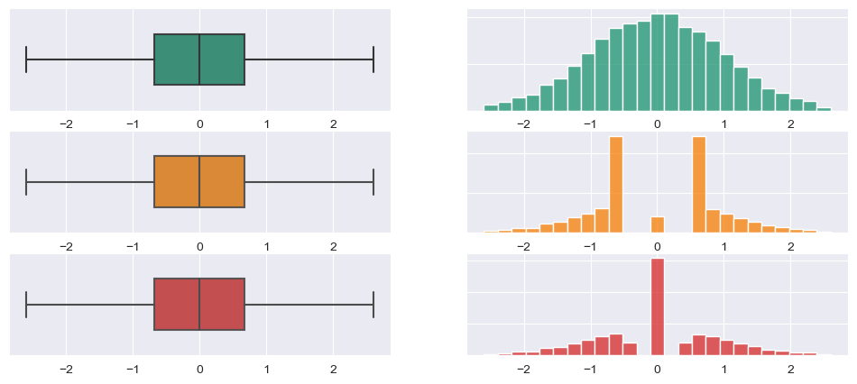

```{r setup, include=FALSE}
knitr::opts_chunk$set(echo = TRUE, fig.width = 6, fig.height = 5)
```

# Introduction

We already know how to extract useful information from data frames. Various statistics tell us a lot about the data. Nevertheless, values of mean, quantiles and standard deviations are inconvenient for understanding the *whole picture.*

We get the most information through our eyes, therefore the skill of presenting the data visually is on of the most powerful. By creating simple visualisations, you can make initial hypotheses and understand possible relationships between variables.

# Libraries

```{r, warning=FALSE, message=F}
# install.packages('ggplot2')
library(ggplot2)
library(dplyr)
library(tidyr)
```

# Distributions

Any general population have its distribution...

# Working data

Today we will work with **iris dataset**. It id already included in R by default.

> This famous (Fisher's or Anderson's) iris data set gives the measurements in centimeters of the variables sepal length and width and petal length and width, respectively, for 50 flowers from each of 3 species of iris. The species are *Iris setosa*, *versicolor*, and *virginica*

{width="1000"}

```{r}
data(iris)
head(iris)
```

# Basic Visualization

## plot()

The simplest graph is a points, each having x and y coordinates

```{r}
x = 1:10
y = seq(2,20,2) ^ 2
x
y
```

We consider that the x and y coordinates at the same positions in each of the vectors correspond to one particular point. So we have points (1,2), (2,4), (3,6) and etc.

-   `seq(from_value, to_value, by_value)`- returns a vector with values from `from_value` to `to_value`with a step `by_value`

### Scatter plot

```{r}
plot(x, y)
```

### Sepal.Length vs Sepal.Width

```{r}
plot(iris$Sepal.Length, iris$Sepal.Width)
```

We can make this graph prettier

```{r}
plot(iris$Sepal.Length, iris$Sepal.Width,
     main = "Sepal.Length vs. Sepal.Width", # the title
     xlab = "Sepal.Length", # Label of X-axis
     ylab = "Sepal.Width", # Label of Y-axis 
     col = "blue", # color of plot
     pch = 19, # type of dots - 19 corresponds to the painted (solid) points
     cex = 1, # size of dots
     ) 
```

<<<<<<< HEAD
=======
{width="300"}

>>>>>>> 52e1a05 (second_commit)
### Adding lines

By default `plot()` shows scatter plot, but we can change this behavior

```{r}
plot(x, y,type = 'l') 
<<<<<<< HEAD
plot(x, y,type = 'b')
plot(x, y, type = 'o' )
=======
plot(x, y,type = 'b', lwd = 3) # lwd = linewidth
plot(x, y, type = 'o')
>>>>>>> 52e1a05 (second_commit)
```

#### Terrible plot

Line graphs should sometimes be avoided, because **lines connect points in the order of their position in the vectors**

```{r}
x = c(10,5,9,6,8,7,2,1,4,3)
y = c(1:4, 6:8,5,10,9)

plot(x, y, type = "p", pch=19)
plot(x, y, type = "b",  pch=19)
```

After sorting:

```{r}
# Advanced

# indexes_to_sort = order(x)
# x_sorted = x[indexes_to_sort]
# y_sorted = y[indexes_to_sort]
# plot(x_sorted, y_sorted, type = "b", pch=19)

df = data.frame(x, y) %>% arrange(x)
plot(df$x, df$y,type = "b", pch=19)

```

> **NB!** We can't just sort one of the vectors because we must save the correspondence of x and y coordinates between two vectors.

## Bar Plots

```{r}
heights = c(Roman = 190, Ann = 172, Charlie = 121) # named vector
barplot(heights)
```

We can make this graph prettier

```{r}
barplot(heights, 
        main = "Heights of people", # the title 
        xlab = "Height", # Label of X-axis 
        ylab = "Name", # Label of Y-axis 
        col = "lightblue", # color of inner part of bars
        border = "blue", # color of borders
        horiz = TRUE, # make barplot horizontal
        xlim = c(0,200) # limits of values showd on x-axis
        )
```

### Number of Iris species

```{r}
number_of_species = table(iris$Species)
barplot(number_of_species,
        col = 'violet')
```

Now we see that our data **"is balanced"**

## Histograms

### Distribution of Sepal.Length

```{r}
hist(iris$Sepal.Length, # only x-axis! 
     main = "Sepal.Length distribution", 
     xlab = "Sepal.length", 
     col = "lightgreen", 
     breaks = 8 # number of x-axis splits for frequency calculation in each of the resulting ranges
     )
```

**Each bar represents frequency of irises with this particular `Sepal.Length`.\
For example, first bar have height of 5 - it mean, that there are 5 flowers with `Sepal.Length` between 4 and 4.5.**

We can make bars two times thinner

```{r}
hist(iris$Sepal.Length,
     main = "Sepal.Length distribution", 
     xlab = "Sepal.length", 
     col = "lightgreen", 
     breaks = 16) # <---- changed
```

## Boxplots

Boxplots are very informative charts. They display similar but more information than a histogram.

{width="1000"}

{width="1000"}

```{r}
boxplot(iris$Sepal.Length, 
        # main = "Sepal.Length", 
        ylab = "",
        xlab = "Sepal.Length", 
        col = "darkviolet",
        horizontal = T)
```

### Grouped boxplots

```{r}
boxplot(iris$Sepal.Length ~ iris$Species, 
        main = "Sepal.Length",
        xlab = "Species",
        ylab = "Sepal.Length", 
        col = "darkviolet",
        horizontal = F)
```

> Boxplot is good for **unimodal** similar to normaldistributions, as it doesn't show *two peaks*

{width="900"}

# ggplot

## Phylosophy

-   The ggplot is based on 3 things: **data**, [**aesthetics**]{.underline} and [**geoms**]{.underline} (geomertric images)

-   Inside the **geoms** there are **aesthetics**.

-   Inside the **aesthetics** we put the **variables** from the **data** that we want to see in the plot. These will be our axes.

-   **An axis is not just an x and y coordinate** - any aesthetic, such as a *fill*,*color,size etc.* can also be an (*pseudo*)axis.
