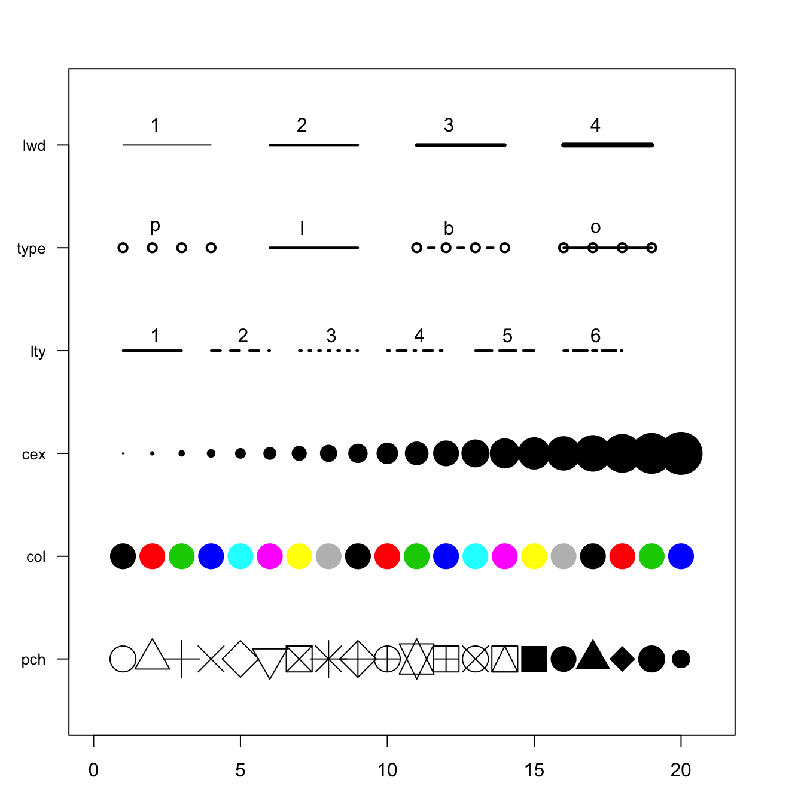
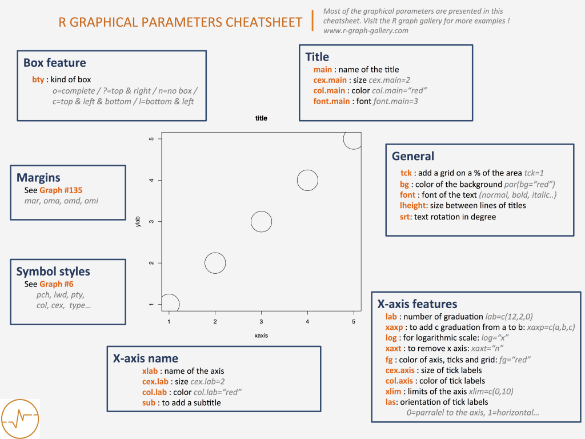

```{r setup, include=FALSE}
knitr::opts_chunk$set(echo = TRUE, dpi = 300, fig.width = 5, fig.height = 4)
```

# Introduction

We already know how to extract useful information from data frames. Various statistics tell us a lot about the data. Nevertheless, values of mean, quantiles and standard deviations are inconvenient for understanding the *whole picture.*

We get the most information through our eyes, therefore the skill of presenting the data visually is on of the most powerful. By creating simple visualisations, you can make initial hypotheses and understand possible relationships between variables.

# Libraries

```{r, warning=FALSE, message=F}
# install.packages('ggplot2')
library(ggplot2)
library(dplyr)
library(tidyr)
```

# Working data

Today we will work with **iris dataset**. It id already included in R by default.

> This famous (Fisher's or Anderson's) iris data set gives the measurements in centimeters of the variables sepal length and width and petal length and width, respectively, for 50 flowers from each of 3 species of iris. The species are *Iris setosa*, *versicolor*, and *virginica*

{width="1000"}

```{r}
# data(iris)
head(iris)
```

### Adding new factor

```{r}
iris_df = iris 
iris_df$Sepal.Length.Category = cut(x=iris_df$Sepal.Length,
                                    breaks = c(4,6,8),
                                    labels = c('short', 'long'))
iris_df %>% head()
```

# Basic Visualization

## plot()

The simplest graph is a points, each having x and y coordinates

```{r}
x = 1:10
y = seq(2,20,2) ^ 2
x
y
```

We consider that the x and y coordinates at the same positions in each of the vectors correspond to one particular point. So we have points (1,2), (2,4), (3,6) and etc.

-   `seq(from_value, to_value, by_value)`- returns a vector with values from `from_value` to `to_value`with a step `by_value`

### Scatter plot

```{r}
plot(x, y)
```

### Sepal.Length vs Sepal.Width

```{r}
plot(iris_df$Sepal.Length, iris_df$Sepal.Width)
```

We can make this graph prettier

```{r}
plot(iris_df$Sepal.Length, iris_df$Sepal.Width,
     main = "Sepal.Length vs. Sepal.Width", # the title
     xlab = "Sepal.Length", # Label of X-axis
     ylab = "Sepal.Width", # Label of Y-axis 
     col = "blue", # color of plot
     pch = 19, # type of dots - 19 corresponds to the painted (solid) points
     cex = 1 # size of dots
     ) 
```

### All plot() style parameters

{width="1000"}

#### All basic R graphical parameters

::: {collapse="'true'"}

:::

### Adding lines

By default `plot()` shows scatter plot, but we can change this behavior

```{r}
plot(x, y,type = 'l') 
plot(x, y,type = 'b', lwd = 3) # lwd = linewidth
plot(x, y, type = 'o')

```

#### Terrible plot

Line graphs should sometimes be avoided, because **lines connect points in the order of their position in the vectors**

```{r}
x = c(10,5,9,6,8,7,2,1,4,3)
y = c(1:4, 6:8,5,10,9)
x
y
```

```{r}
plot(x, y, type = "b",  pch=19)
```

After sorting:

```{r}
df = data.frame(x, y) %>% arrange(x)
plot(df$x, df$y,type = "b", pch=19)
```

> *ggplot2 doesn't have such problem*

```{r collapse=TRUE}
# basic r advanced

# indexes_to_sort = order(x)
# x_sorted = x[indexes_to_sort]
# y_sorted = y[indexes_to_sort]
# plot(x_sorted, y_sorted, type = "b", pch=19)
```

> **NB!** We can't just sort one of the vectors because we **must save the correspondence of x and y** coordinates between two vectors.

## Bar Plots

```{r}
heights = c(Roman = 190, 
            Ann = 172, 
            Charlie = 121,
            Vlad = 183,
            Sasha = 180) # named vector
heights 
heights = heights %>% sort(decreasing = T)
barplot(heights)
```

We can customize this graph

```{r}
barplot(heights, 
        main = "Heights of people", # the title 
        xlab = "Height", # Label of X-axis 
        ylab = "Name", # Label of Y-axis 
        col = "lightblue", # color of inner part of bars
        border = "blue", # color of borders
        horiz = TRUE, # make barplot horizontal
        xlim = c(0,200) # limits of values showd on x-axis
        )
```

### Number of iris_df species

```{r}
number_of_species = table(iris_df$Species)
barplot(number_of_species,
        col = 'violet')
```

Now we see that our data **"is balanced"**

## Histograms

### Distribution of Sepal.Length

```{r}
hist(iris_df$Sepal.Length, # only x-axis! 
     main = "Sepal.Length distribution", 
     xlab = "Sepal.length", 
     col = "lightgreen",
     breaks = 8 # number of x-axis splits for frequency calculation in each of the resulting ranges
     )
```

**Each bar represents frequency of this particular `Sepal.Length` in dataset.\
For example, first bar have height of 5 - it mean, that there are 5 flowers with `Sepal.Length` between 4 and 4.5.**

We can make bars two times thinner

```{r}
hist(iris_df$Sepal.Length,
     main = "Sepal.Length distribution", 
     xlab = "Sepal.length", 
     col = "lightgreen", 
     breaks = 16) # <---- changed
```

## Boxplots

Boxplots are very informative charts. They display similar but more information than a histogram.

{width="800"}

{width="800"}

```{r}
boxplot(iris_df$Sepal.Length, 
        # main = "Sepal.Length", 
        ylab = "",
        xlab = "Sepal.Length", 
        col = "darkviolet",
        horizontal = T)
```

### Grouped boxplots

```{r}
boxplot(iris_df$Sepal.Length ~ iris_df$Species, 
        main = "Sepal.Length",
        xlab = "Species",
        ylab = "Sepal.Length", 
        col = "darkviolet",
        horizontal = F)
```

> Boxplot is good for **unimodal** similar to normaldistributions, as it doesn't show *two peaks*

{width="800"}

# ggplot

**`ggplot2` is the most popular package for charts creations.**

## Philosophy

-   The ggplot is based on 3 things: [**data**]{.underline}, [**aesthetics**]{.underline} and [**geoms**]{.underline} **(geomertries)**

-   Inside the **geoms** there are **aesthetics**.

-   Inside the **aesthetics** we put the **variables** from the **data** that we want to see in the plot. These will be our axes.

-   **An axis is not just an x and y coordinate** - any aesthetic, such as a *fill*,*color,size etc.* can also be an (*pseudo*)axis.

-   [**Each component in the graphic is added layer by layer**]{.underline}

{width="355"}

## Intro

```{r}
ggplot(data=iris_df, # data
       mapping = aes(x=Sepal.Length, y=Sepal.Width)) + #aesthetics (axes)
  geom_point()  # geom
```

**Obligatory components to create chart:**

1.  `ggplot(data=iris_df)` - **data**: `data.frame`, `tibble` ...
2.  `ggplot(..., mappings=aes(x=Sepal.Length, y=Sepal.Width))` - **aesthetics**, which turned into x and y axis.
3.  `+ geom_point()` - **geom**, at least one.

## Storing plots in variables

```{r}
p = ggplot(data=iris_df, mapping = aes(x=Sepal.Length, y=Sepal.Width)) + geom_point()

p
```

## Adding new aesthetics ("axes")

### Adding right to the `ggplot()`

```{r}
ggplot(data=iris_df,
       mapping = aes(x=Sepal.Length, 
                     y=Sepal.Width,
                     color=Species, 
                     size = Petal.Width,
                     shape=Sepal.Length.Category)) + 
  geom_point() 
```

### Adding to variable

```{r}
p + aes(color=Species, size = Petal.Width,
        shape=Sepal.Length.Category)
```

### Aesthetics list

-   `color` - color

-   `fill` - filling color

-   `size` - size

-   `shape` - shape of points

-   `stroke` - stroke thickness

-   `alpha` - transparency

-   *other specific for geoms aesthetics...*

## Geoms

Geometries define the types of graphs in the diagram.

### Geoms have specific variables

```{r}
iris_df %>% 
  ggplot(aes(x=Sepal.Width)) +   # <--- here
  geom_histogram(bins = 20, fill='lightblue', col='black')
```

### Aesthetics can also be set up within the geoms

-   aesthetics inside `ggplot()` are set for **all geoms**

-   aesthetics inside `geom_..()` functions are set only for this geom

```{r}
iris_df %>% 
  ggplot() + 
  geom_histogram(aes(x=Sepal.Width),
                 bins = 20, fill='lightblue', col='black')  # <--- here
```

### Adding several geoms

```{r}
iris_df %>% 
  ggplot(aes(x=Species, y=Sepal.Length)) + 
  geom_boxplot(aes(fill=Species), outliers = F) +
  geom_jitter(width=0.1)

```

### Variables and aesthetics

> As you have seen,`fill`, `color`, `size`, `shape`, `stroke` and `alpha` can be seen outside of `aes()`. They can also be set to a specific fixed value.
>
> **Each geom has a certain set of parameters. In `aes()` there are mandatory and optional parameters, and outside it there are only optional parameters**

#### Inside the `aes()`

```{r}
iris_df %>% 
  ggplot(aes(x=Sepal.Length, y=Sepal.Width)) +
  geom_point(aes(color=Species)) # <--- here
```

#### Outside the `aes()`

```{r}
ggplot(data=iris_df,
       mapping = aes(x=Sepal.Length, y=Sepal.Width)) +
  geom_point(color='blue')  # <--- here
```

### Geoms can take different data!

```{r}
iris_df %>% 
  ggplot(aes(x=Sepal.Length, y=Sepal.Width)) +
  
  geom_point(data=iris_df %>% filter(Sepal.Width > 3), # data (filtered iris)
             aes(color=Species)) +
  
  geom_hex(data=iris_df %>% filter(Sepal.Width < 3)) # another data (filtered iris)
```

## Themes

### Built-in themes

```{r}
p + theme_bw()
p + theme_classic()
p + theme_void()
```

### Custom themes (*Advanced*)

```{r}
p = p + theme(axis.text = element_text(size = 15),
          axis.title = element_text(size = 20),
          panel.background = element_rect(fill = 'white', color='black'))
p
```

## Labels

```{r}
p +  labs(x='Sepal length', 
          y='Sepal width',
          
          color = 'Iris species',
          # fill =
          # size = 
          # shape = 
          # stroke =
          
          title = 'Scatter plot', 
          subtitle = 'Subtitle',
          caption = 'It is the great plot',
          tag = 'A')
```

Simple functions for labeling axes: `+ xlab()` and `+ ylab()`

# Let's draw!

## Scatter plot

```{r}
iris_df %>% ggplot(aes(x=Petal.Length, y=Petal.Width)) + 
  geom_point() + theme_classic()
```

## Histogram

```{r}
iris_df %>% ggplot(aes(x=Petal.Length)) + 
  geom_histogram(color='blue', fill='lightblue') +
  theme_classic()
```

## Density plot

```{r}
iris_df %>% ggplot(aes(x=Petal.Width, fill=Species)) + 
  geom_density(alpha=0.8) + theme_classic()
```

## Boxplot

```{r}
iris_df %>% ggplot(aes(x=Petal.Width, y=Species, fill=Species)) + 
  geom_boxplot() + theme_classic() + theme(legend.position = "none")
```

> **Yes, we can combine custom and built-in themes in one plot**

### Deleting the legend (as it duplicates `color` information)

-   `+ theme(legend.position = "none")`

## Barplots

```{r}
sepal_len_stats = iris_df %>% group_by(Species) %>% 
  summarise(mean_sepal_len = mean(Sepal.Length), 
            sd_sepal_length = sd(Sepal.Length))

sepal_len_stats
```

### `geom_col` - if heights of bars are known (continuous data)

```{r}
p_col = sepal_len_stats %>% 
  ggplot(aes(x=Species, y=mean_sepal_len, fill=Species)) + 
  geom_col() + theme_classic() + theme(legend.position = "none")

p_col
```

### Adding `geom_errorbar` (SD)

```{r}
p_col + geom_errorbar(aes(ymin=mean_sepal_len-sd_sepal_length,
                          ymax=mean_sepal_len+sd_sepal_length),
                      width=0.3)
```

> Three different types of values are commonly used for error bars, *sometimes without even specifying which one is used*.
>
> -   **Standard deviation**
>
> -   **Standard error**
>
> -   **Confidence interval**
>
> We will discuss each later

### `geom_bar` - if heights are unknown (counting categorical data)

```{r}
iris_df %>% ggplot(aes(x=Sepal.Length.Category, 
                       fill=Sepal.Length.Category)) + 
  geom_bar() + theme_bw() + theme(legend.position = "none")
```

### `position="stack"` (by default)

```{r fig.width=4, fig.height=6}
iris_df %>% ggplot(aes(x=Sepal.Length.Category, fill=Species)) + 
  geom_bar() + theme_bw() 
```

### `position="fill"` - scaled from 0 to 1

```{r fig.width=4}
iris_df %>% ggplot(aes(fill=Species, x=Sepal.Length.Category)) + 
  geom_bar(position = 'fill') + theme_bw()
```

### `position="dodge"`

```{r}
iris_df %>% ggplot(aes(fill=Species, x=Sepal.Length.Category)) + 
  geom_bar(position = 'dodge')  + theme_bw()
```

## Something big and difficult

```{r, warning=FALSE}
ggplot(iris, aes(x = Species, y = Sepal.Length)) +
  geom_violin(aes(fill = Species), alpha = 0.4) +  # Violin plots
  geom_boxplot(fill = "lightgray", alpha = 0.6, outliers = F, width=0.2) + 
  geom_jitter(aes(fill = Species), width = 0.2, alpha = 0.5, shape=21, col='black') +  
  geom_hline(aes(yintercept = mean(Sepal.Length)), col='red', linewidth=1, lty=2) +
  geom_text(aes(label='Global mean', x = 'setosa', y=mean(Sepal.Length)+0.1), col='red') +
  labs(title = "Boxplot of Sepal Length by Species with Jittered Points",
       x = "Species",
       y = "Sepal Length (cm)") +
  theme_minimal()

```

### New geoms used

-   `geom_violinplot()` - Violin plot

-   `geom_hline()` - horizontal line

-   `geom_text()` - just text

## Saving the plot

### To save [last]{.underline} drawn plot:

```{r}
ggsave(
  filename = './bigplot.png', # specify the filename (path to file)
  device = , # png, pdf, jpeg, svg and others
  dpi = 320, # resolution
  width = 1800,
  height = 1600,
  units = "px" #in, cm, mm
)
```

### Save "everything between"

```{r}
pdf("./dodge_barplot.pdf", width = 6, height = 6)

iris_df %>% ggplot(aes(fill=Species, x=Sepal.Length.Category)) + 
  geom_bar(position = 'dodge')

dev.off()
```

This structure allow save into pdf all graphical outputs that between `pdf()` and `dev.off()`

# ggpubr (Advanced)

```{r, warning=FALSE, message=FALSE}
# install.packages('ggpubr')
library(ggpubr)
```

## Barplot

```{r}
iris_df %>%  ggbarplot(x="Species", y="Sepal.Width",
                       fill='Species',
                       add = "mean_sd" # calculate mean and sd
                       )
```

## Boxplot

### Statisctics inside!

```{r}
p_pubr = iris_df %>%  ggboxplot(x='Species', y='Sepal.Length', col='Species')

comparisons <- list( c("setosa", "versicolor"), 
                     c("setosa", "virginica"), 
                     c("virginica", "versicolor") )

p_pubr + stat_compare_means(comparisons = comparisons, 
                            label = "p.signif")+ 
  stat_compare_means(label.y = 10)
```

See more about `ggpubr` [**HERE**](https://rpkgs.datanovia.com/ggpubr/)

# P.S

## Customizing `fill` - `scale_fill_manual()`

```{r}
# Advanced -------
iris_df %>% ggplot(aes(x=Species, y=Sepal.Length)) +
  stat_summary(aes(fill=Species), geom = 'bar', fun = mean) +
  geom_jitter(aes(fill=Species), shape=21, width = 0.1, 
              stroke=0.5, col='black') +
  theme_bw() + 
  labs(title = 'Barplots with jitter') +
# ----------

scale_fill_manual(
  values=c("#e63946", "#ffba49", "#457b9d"),
  labels=c('Setosa sp.', 'Versicolor sp.', 'Virginica sp.'),
)

```

## Customizing `color` - `scale_color_manual()`

```{r}
iris_df %>% ggplot(aes(x=Sepal.Length, y=Sepal.Width, col=Species)) +
  geom_point(alpha=0.6, size=4) +
  theme_classic() + 

scale_color_manual(
  values=c("#e63946", "#ffba49", "#457b9d"),
  labels=c('Setosa sp.', 'Versicolor sp.', 'Virginica sp.'),
)
```

## Facets

### `facet_wrap()`

```{r fig.width=8, fig.height=3}
iris_df %>% ggplot(aes(x=Petal.Length, y=Petal.Width)) +
  geom_point(alpha=0.6, size=2) +
  theme_bw() +

# ----------------------

facet_wrap(. ~ Species)
```

### `facet_grid()`

```{r fig.width=8, fig.height=6}
iris_df %>% ggplot(aes(x=Petal.Length, y=Petal.Width)) +
  geom_point(alpha=0.6, size=2) +
  theme_bw() +
# ----------------------
  facet_grid(cols = vars(Species),
             rows=vars(Sepal.Length.Category))

  # facet_wrap(Sepal.Length.Category ~ Species)

```
