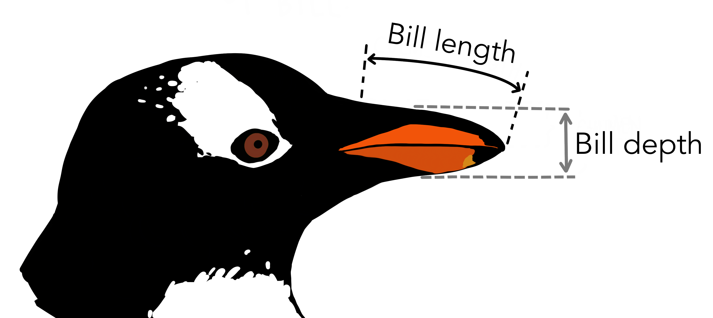

```{r setup, echo=F}
knitr::opts_chunk$set(echo = T, warning = F, message = F,
                      fig.width = 7, fig.height = 5)
# Load necessary libraries
```

```{r}
library(ggplot2)
library(dplyr)
```

# Palmer Penguins

#### 0. Read file penguins.csv

-   *Don't forget to use all necessary parameters which were used in previous work*

-   Look at the data (summary? structure? something else you want)

```{r}
#
```

The `penguins` dataset contains data collected on three penguin species (Adelie, Chinstrap, and Gentoo) from three islands (Torgersen, Biscoe, and Dream) in the Palmer Archipelago, Antarctica.

It includes measurements like:

-   `bill_length_mm` and `bill_depth_mm` - dimensions of the penguin's bill.

-   `flipper_length_mm` - length of the penguin's flippers.

-   `body_mass_g` - weight of the penguins in grams.

-   `island` - the island where the penguins were observed.

-   `sex`: the gender of the penguin.

Some rows may contain missing values (e.g., in `sex` column).

{width="1000"}

#### 1.\* Delete rows containing only NAs in columns except `species, sex, island`.

```{r, eval=F}
#
```

-   Remember `complete.cases()` and remember the ways we filtered datasets
-   Ensure, that dataset was filtered!

#### 2. Create bar plot to show the number of observations (rows) for each `species` and delete legend (if `ggplot` used).

-   Label the axes and legends

-   Colors (`fill`) should also be different for each species

-   `theme_classic()`, if `ggplot` used

-   **This task can be solved using either basic R or `ggplot`**

-   *Tip:* use `table()` (basic R and `ggplot`) or `geom_bar()` (`ggplot`)

-   **Don't forget to delete legend** *if ggplot used*

```{r}
#
```

#### 3. Create stacked barplot scaled from 0 to 1 to show the proportion of `species` on each `island`.

-   Label the axes and legends

-   `theme_classic()`

-   `fill` should represent `species`.

-   Don't forget change `position` parameter

```{r}
#
```

#### 4. Create a histogram for the `flipper_length_mm` and draw the vertical line to show mean value

-   Label the axes

-   Set the number of breaks to 10

-   The histogram fill should be `"lightblue"` and border (color) should be `"black"`

-   Vertical line color = `'red'`, `width = 1.2`

-   `theme_bw()`, if `ggplot` used

-   **This task can be solved using either basic R or `ggplot`**

```{r}
#
```

#### 5. Create a density plot for the `body_mass_g` variable. Fill the density regions based on `species`.

-   Label the axes (y-axis is `Density`)

-   `fill` should be different for each species

-   Density plot should have `alpha=0.5`

-   `theme_classic()`

```{r}
#
```

#### 6. Create a boxplots grouped by `sex` to compare `bill_length_mm` values. Save the plot in variable and show the plot.

-   **Filter out observations without known `sex`** **(!)**

-   Label the axes and legends

-   Colors (`fill`) should also be different for each `sex`

-   `theme_classic()`

-   **When you save the plot in a variable, chart is not displayed. Don't forget to show the plot by writing the variable name on a new line!**

```{r}
#
```

#### 7. Change the chart above: for each `sex` there must be 3 colored boxplots for each `species`. Each `species` should be *specifically* colored (`fill)`.

-   *Tip:* just add (`+`) corresponding `aes(...)` to the variable

```{r}
#
```

#### 8. Create a scatter plot to show the relationship between `bill_length_mm` and `bill_depth_mm`.

-   Label the axes

-   Make dots colored filled with `'blue'`

-   Use `theme_classic`, if `ggplot` used

-   **This task can be solved using either basic R or `ggplot`**

```{r}
#
```

#### 9. Create a [Bubble plot]{.underline}: a scatter plot depicting the relationships between `length_last_mm` and `depth_last_mm`, with colored dots representing `species` and sizes reflecting `length_last_mm`.

-   Label the axes and legends

-   Points should have `alpha=0.7`

-   `theme_classic()`

```{r}
#
```

#### 10\*. Add `geom_rug()` to the above plot to show distribution of points across the axes

-   To do that you should save plot above in variable and add `geom_rug()`
-   reduce *line width* to 0.5, *alpha* to 0.8 and set `show.legend = FALSE`

```{r}
#
```
